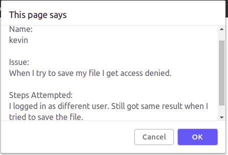

# CodingChallenges
A series of code challenges

*NOTE* that you can use any language you choose and are not limited to JavaScript or other. Be as creative as you can with these challenges.

### Integer Numbers Range

Write some code with a function/method that accepts two integers `x1` and `x2` returns all the integers between them. If `x2` is lower than `x1` it should return -1. Provide output to console or web page.

### Multiplications table

Write a function/method that writes in the console the multiplication table (from 1 to 10)

### Multiplications table on demand

Write a function/method that writes in the console the multiplication table (in one column) of any number passed as parameter

### Calculation

Write a program that writes in the console or a web page all the multiples of 23 less than 500 and at the end writes out the sum of all of them. Once working enhance so that the user can provide the multiple and ending number rather than hard coding it.

    Elements : 0 23 46 69 92 115 138 161 184 207 230 253 276 299 322 345 368 391 414 437 460 483
    Sum : 5313

### `max()` function/method

Define a function/method max() that takes two numbers as arguments and returns the largest of them in the console or web page. 

### `maxOfThree()` function/method

Define a function/method maxOfThree() that takes three numbers as arguments and returns the largest of them.

### `isVowel()` function/method

Write a function/method that takes a character (i.e. a string of length 1) and returns true if it is a vowel, false otherwise.

### Hexadecimal 

Write a function/method that convert a hexadecimal color, "blue" for example "#0000FF" in its RGB representation rgb(0,0,255)". Give the function/method the name getRGB(). An example in JavaScript would produce the following in the JavaScript console.

    >>> var a = getRGB ('#00FF00');
    >>> a;
    “rgb(0,255,0)”;

### Hexadecimal enhanced

Improves the previous function/method so that in addition to the conversion also identifies some basic colors:
- Black: #000000
- White: #FFFFFF
- Red: #FF0000
- Green: #00FF00
- Blue: #0000FF

So the result would be when using JavaScript for these cases in the JavaScript console:

    >>> var a = getRGB ('#00FF00'); 
    >>> a;
    “rgb(0,255,0)   verde”;

## Create a user feedback form using form/prompt
You can use an HTML form or console prompts to collect the 3 pieces of required information. 
Name, issue, and steps to reproduce the error.

- Prompt for the User's name
- Prompt for the description of the issue they are experiencing
- Prompt for the steps that can be used to re-produce the user's issue
- If the user enters a blank string *for any property*, display an alert to let them know all fields must be populated, and then restart the iteration of the loop so they can reenter all 3 fields again.
- Keep prompting the user *until all 3 fields are provided* otherwise make user start over and enter all 3 fields again.

Once all 3 values collected, use a template literal that displays the entered information using a `confirm` dialog box.
The confirm box should display the information entered.

